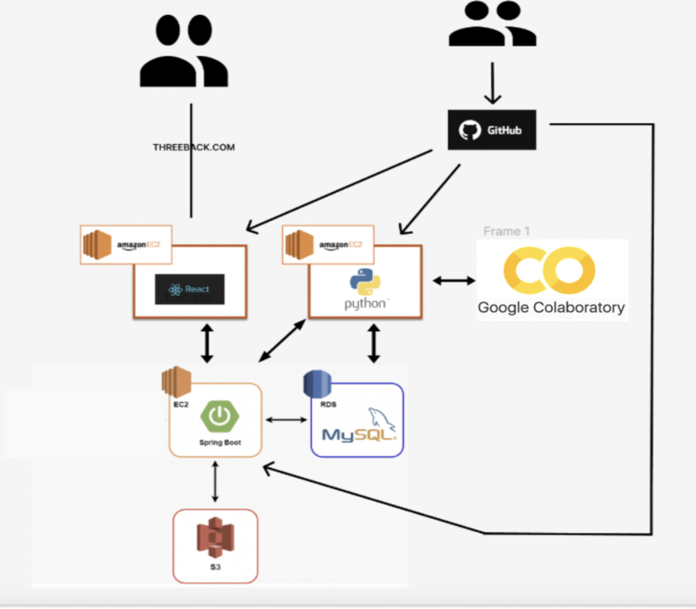

# AI 기반 스포츠 관람 장소 추천 서비스

## 프로젝트 개요
AI 기반 스포츠 관람 장소 추천 서비스는 사용자의 선호도와 경기 일정 등을 고려하여 최적의 스포츠 경기 관람 장소를 추천하는 서비스입니다. 이 서비스는 React로 구축된 프론트엔드와 Spring Boot를 기반으로 한 백엔드를 활용하여, 인공지능 알고리즘을 통해 맞춤형 추천을 제공합니다.

## 팀 소개
- **고재휘** (팀장)
- 서용
- 김기찬
- 이동건

## 프로젝트 기간
2024.03 ~ 2024.06

## 기술 스택
- **FrontEnd**: React, Amazon EC2
- **BackEnd**: Spring Boot, Java, Amazon EC2, MySQL, Amazon S3
- **AI**: Python, Jupyter Notebook

## 주요 기능
- 사용자 맞춤형 스포츠 경기 관람 장소 추천
- AI 알고리즘을 통한 데이터 분석 및 예측
- 클라우드 기반의 데이터 처리 및 저장

